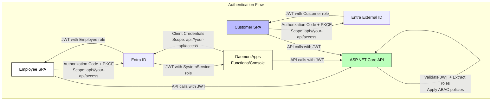

# Authorization
 
## Understanding Scopes vs App Roles
 
OAuth2 scopes define what permissions are being requested and granted. In the context
of Microsoft identity platform:

- **Delegated permissions (scopes)**: Used when a user is present. The app acts on 
  behalf of the signed-in user. The effective permissions are the intersection of 
  what the app is granted AND what the user can do.
  
- **Application permissions (app roles)**: Used for service-to-service scenarios 
  (client credentials flow). The app acts with its own identity, no user context.

For resources like Microsoft Graph, scopes make sense because you're accessing 
user-specific data in an external system (email, calendar, files, etc.).

For your own business APIs, the pattern differs:

**User Access (Delegated)**:
1. Is this user authenticated? (JWT from Entra ID/External ID)
2. What app roles are assigned to them? (App roles in the `roles` claim)
3. What can they do in the application? (Your authorization logic/ABAC)

**Service Access (Application)**:
1. Is this service/daemon authenticated? (JWT via client credentials)
2. What app roles are assigned to the service principal? (App roles in `roles` claim)
3. What can it do? (Your authorization logic)

## Decision

For your business APIs, you should:

1. **Define a scope** for API access (e.g., `api://your-api-id/access`). This controls 
   WHO can call your API at all.
   
2. **Define app roles** for authorization logic (e.g., `Employee`, `Customer`, 
   `Administrator`, `SystemService`). These appear in the JWT's `roles` claim.

3. **Implement your authorization** using the roles claim along with your ABAC system 
   to determine what specific actions a user/service can perform.

### Key Points

- **You need at least one scope** defined on your API registration. This scope must be 
  granted to client applications that call your API.
  
- **App roles are assigned to users or service principals** and appear in the `roles` 
  claim of the JWT token.
  
- **For user authentication flows** (authorization code with PKCE): Users get tokens 
  with both the scope AND their assigned app roles.
  
- **For daemon/service flows** (client credentials): Service principals get tokens 
  with the scope AND their assigned app roles.

- **The scope grants access to the API**; the roles determine what they can do once 
  they're in.

### Diagram


## Configuration Example

**API App Registration** (Entra ID):
- Expose an API scope: `api://12345678-api-guid/access`
- Define app roles: `Employee`, `Administrator`, `SystemService`

**Employee SPA App Registration** (Entra ID):
- Request delegated permission: `api://12345678-api-guid/access`
- Users assigned the `Employee` app role (on the API registration)

**Daemon App Registration** (Entra ID):
- Request application permission: `api://12345678-api-guid/access`
- Service principal assigned the `SystemService` app role (on the API registration)

**Customer SPA App Registration** (Entra External ID):
- Request delegated permission: `api://12345678-api-guid/access`
- Users assigned the `Customer` app role (on the API registration)

## In Your API
```csharp
// Validate the scope is present
[RequiredScope("access")]
// Validate the role is present
[Authorize(Roles = "Employee,Administrator")]
public IActionResult GetEmployeeData()
{
    // Further ABAC checks based on user context
}
```